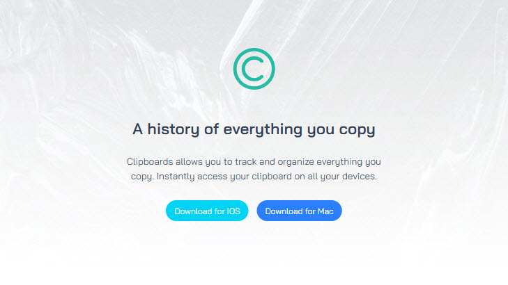
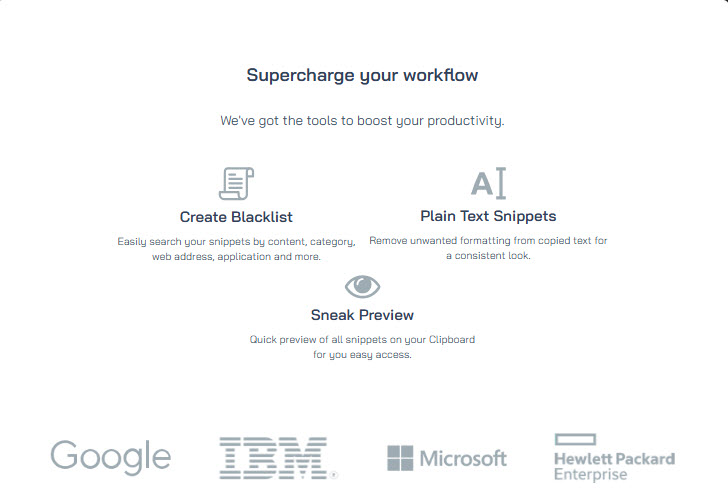

# Clipboard-website
Project 1 for 'Tailwind From Scratch' - Packt 

### Getting started

```bash
git clone https://github.com/RamirezJM/Clipboard-website.git

cd Clipboard-website

npm install
```

### Usage

```bash
npm run dev
```

<div>
  
</div>

<div>
  
</div>


